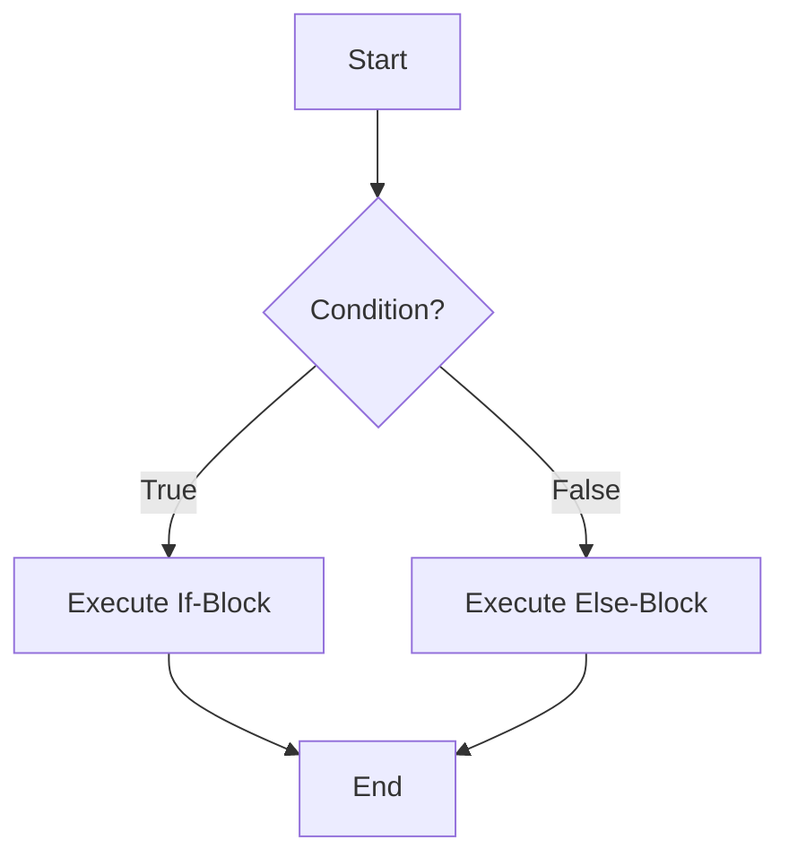
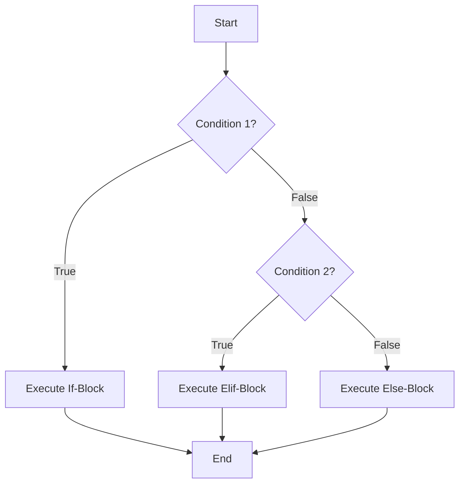
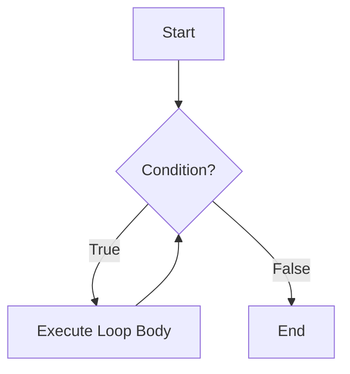

# Ohjelmisto 1 rA - Syksy 24 - tuntiesimerkkejä

Opettajien Github-tunnukset: mattpe ja jormaraty

## If-else vs. while

If:

```mermaid
graph TD;
    A[Start] --> B{Condition?};
    B -->|True| C[Execute If-Block];
    B -->|False| D[Execute Else-Block];
    C --> E[End];
    D --> E[End];
```

If & else-if:

```mermaid
graph TD;
    A[Start] --> B{Condition 1?};
    B -->|True| C[Execute If-Block];
    B -->|False| D{Condition 2?};
    D -->|True| E[Execute Elif-Block];
    D -->|False| F[Execute Else-Block];
    C --> G[End];
    E --> G[End];
    F --> G[End];
```

While:

```mermaid
graph TD;
    A[Start] --> B{Condition?};
    B -->|True| C[Execute Loop Body];
    C --> B;
    B -->|False| E[End];
```